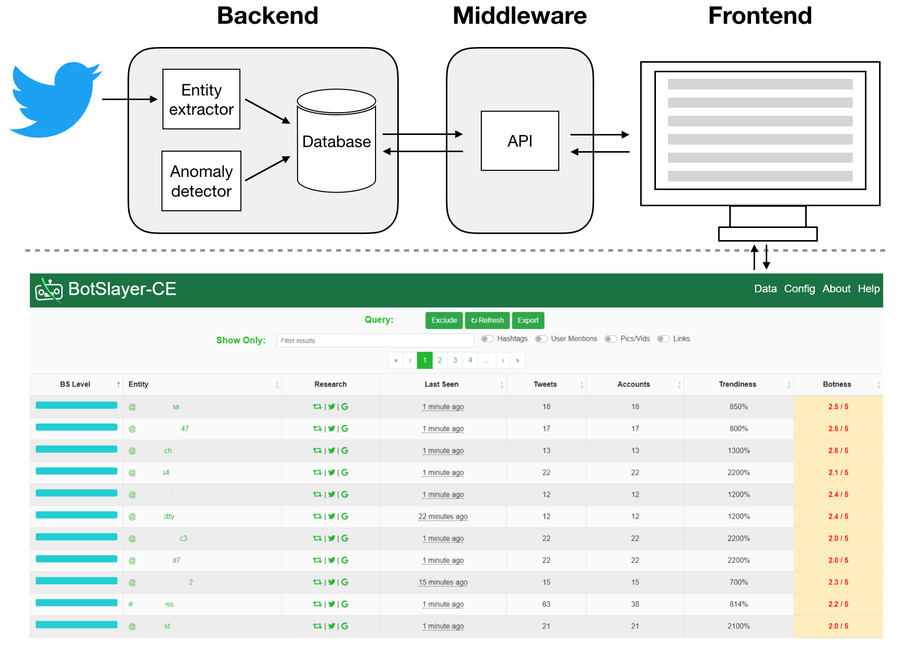

# BotSlayer-CE (Community Edition)

BotSlayer is an application that helps track and detect potential manipulation of information spreading on Twitter.
It's fast and the user-friendly interface makes it suitable for researchers from academia as well as journalists and citizens.

# Installation instructions

To install BotSlayer-CE on any linux machine, user needs to first properly install the container software `docker`. Please follow the instructions on [Docker's website](https://docs.docker.com/install/). Please remember to add your current user to the `docker` user group, which will avoid the need for the `sudo` command when using `docker`. 

With `docker` installed, you can then proceed to clone this repository, e.g.

    git clone https://github.com/IUNetSci/BotSlayer-CE.git

Enter the repo directory, and build the docker image by

    docker build --tag=bsce .

Upon completion of the image building, you can setup storage volumes and run the container by

    docker volume create pgdata
    docker run -dit -p 5432:5432 -p 5000:5000 -p 9001:9001 -v pgdata:/var/lib/postgresql/data bsce

Some of the ports used above (5000 for web interface, 5432 for database, 9001 for logging) may be already taken by existing processes in your machine.
For example, port 5432 would be taken if your machine has a PostgreSQL database running before launching BotSlayer.
In this case, you are free to assign your own port, such as port 5555, as destination of the port mapping.
The command to launch BotSlayer will then become:

    docker run -dit -p 5555:5432 -p 5000:5000 -p 9001:9001 -v pgdata:/var/lib/postgresql/data bsce

If the container starts successfully, you should be able to find the frontend at `http://localhost:5000`, with logging running at `http://localhost:9001`.

Users are recommended AGAINST exposing port `9001` to external users, because it contains debugging information, including certain settings in database and middleware. One secure way for developers to gain access to the logging interface is `SSH tunnel` as follows

    ssh -L{destination_port}:localhost:9001 remoteHostIP

# Starting the collection

Now that you have BotSlayer-CE up and running, you can start to configure your instance to track the topics of interest.
After SSH remote login, you can enter the information into the `config` table by accessing the database:

    psql -U bev -h localhost -p 5432 bev

You might need to install `psql` on your machine first.
The password is 'bev'.
Note that although the password is public, only system administrators of the BotSlayer instance can access the database, unless the system administrator exposes the PostgreSQL port which by default is `5432`.
We strongly recommend AGAINST this.
Through the database, the user can access the raw data.
Please refer to the [`db_schema.md`](db_schema.md) for the table schema.
Please be aware of Twitter's [terms and policies](https://developer.twitter.com/en/developer-terms/agreement-and-policy.html) with regard to sharing Twitter content with third parties.

If you have mapped the ports differently for the database (not 5432) when launching the BotSlayer container, please remember to change `-p 5432` to `-p your_destination_port` accordingly.

Please update the fields in the `config` table accordingly. There are different rows for different types of qieries. For example, the `track` row can be used to enter keywords, hashtags, and so on. Please see the Help page for details. 
Note that query terms in `track` and `follow` are comma separated, and the field `cfgpassword` can be safely ignored.
The query will be used to collect tweets of interest from Twitter.

Suppose we want to inspect the health of the online discussion about the 2020 U.S. election; we can use several related hashtags as the query.
Please be aware that if your query hits more than 1% of all Twitter volume at any time, the collection will momentarily halt.
Slower collection also allows the machine to save more data for restrospective analysis.
Please try to strike a good balance between coverage and focus while coming up with your query.

# Testing

## Automated

The automated test for the `backend` can be executed at the directory `backend/bev_backend/bev_backend/test` as follows

    python3 -m unittest discover

We have automated tests for all functions that do not involve direct database IO.
This is because these functions work via side effects on the database, and therefore testing requires a running database instance.

To test the functionalities that involve database interactions, it is best to manually inspect the log outputs at port 9001 when the software is running.

## Manual

In order for BotSlayer-CE to run, you will need app keys from Twitter.
Once you enter consumer key, consumer secret, access token, and access token secret in the dedicated fields of the `Config` table, the change will take effect immediately.

It only takes a few minutes for data to be visible in the dashboard if the query produces enough volume. That is how you will know that the system is working.
However, a fresh BotSlyer-CE instance needs at least 8 hours to collect data for meaningful analysis.

If the system is not collecting data, you will see a warning message on the dashboard (`Data` page) and explanation of possible reasons.

The logs at port 9001 should shows that tweets are being parsed, indexed, and inserted into the database, which ensures that the crawler and the database are working properly.

# System Overview

BotSlayer consists of three parts, namely backend, middleware, and frontend (**Figure 2**). These parts communicate through internal APIs.

## Backend

The `bev_backend` module includes the following:

- `SQL` script to create database
- `Python` crawler script (control by `circus` manager)

We use `PostgreSQL` as our database to host the collected tweets. The database uses three tables to hold
tweet data, a table for raw tweet jsons (called `twtjson`), one for entities (called `entity`), and a
cross-sectional table between the two (called `entitytwt`). The foreign keys enable easy management via
deletion on cascade, and should not be removed without significant discussion.
See [`db_schema.md`](db_schema.md)

We adopt `asyncpg` as the driver for `PSQL`, because the traditional `psycopg2` has a non-compatible license.
In `Python3`, `asyncpg` is pretty much the only actively developed/maintained driver module for `PSQL`.
Note that the async functionality is NOT why we picked it. If in the future there are better choice, we shall
switch to avoid the extra `async/await` syntax in code.

We interact with `Twitter`'s streaming API using the `Tweepy` module.

## Middleware

The middleware is mainly the `Python` file: `application.py` in the `middleware` folder. This is a `Flask` app that serves the frontend distribution (`dist`) folder and handles API calls from the frontend.
See [`API Documentation.md`](API%20Documentation.md).

## Frontend

The frontend is built with `Vue`. The only components used are ones installed with `npm` and imported in `main.js`.

`App.vue` handles the navbar and router links to the other pages below:

 - `About.vue` is a page detailing a short description of what BotSlayer is used for.
 - `DataPage.vue` acts as the landing page. It's where all of the data is shown in a table format with connectivity to Hoaxy, Twitter, and Google.
 - `Help.vue` contains some links to Twitter documentation for getting developer keys and for understanding how their streaming queries should be formatted.

## Entrypoints

The `Dockerfile` uses `SupervisorD` to manage multiple entry points.

The backend will launch via two entrypoints. First, the database will
launch at port `5432`. Then the crawler will start up through the
process manager `circusd`. If the crawler process exits for any reason,
`circusd` will log the error message and restart the process.

The frontend is compiled by `Vue`/`npm` into the `dist` folder, which the `middleware` file `application.py`, serves on port `5000` using `Flask`.

`nginx` doubles as BotSlayer's webserver and reverse proxy.
It gzips all data sent to the browser and allows the user to go directly to their instance's IP address, as opposed to adding the port to the end, like so: `:5000`

# Summary of BotSlayer-CE

As social media became major platforms for political campaigns and discussions of other important issues, concerns have been growing about manipulation of the information ecosystem by bad actors.
Typical techniques used by the bad actors vary from astroturf and amplification of misinformation to trolling .
Attempts to manipulate discussions may and often does involve real humans; examples include trolls from Russia and Iran.
Recent reports show that malicious social bots --- inauthentic accounts controlled in part by software --- have been active during the U.S. presidential election in 2016, the 2017 Catalan referendum in Spain, the French Presidential Election of 2017, and the 2018 U.S. midterm election.

Detecting such manipulation presents serious research challenges. 
First, one needs to collect and analyze data, which requires significant storage and computing resources.
Second, finding patterns and signals of suspicious behaviors from huge amounts of data requires advanced computational skills.
In fact, most studies on this phenomenon are disseminated months or even years after the events.
Detecting potential manipulations from real-time social media data streams remains an open challenge.

To address this challenge, we developed a tool to detect and track potential amplification of information by likely coordinated bots on Twitter in real time.
The tool is called `BotSlayer`. Here we introduce `BotSlayer-CE`, the open-source Community Edition of the tool. There is also [a free but not open-source version](https://osome.iuni.iu.edu/tools/botslayer) that includes a proprietary bot detection software.

BotSlayer-CE is easy to install and can be customized to any topics of interest.
Its embedded algorithms and user-friendly interface make it possible for experts as well as journalists and citizens to study online manipulation. 

**Figure 2** shows an overview of the BotSlayer-CE system architecture with its backend, middleware, and frontend.
The backend collects and analyzes tweets, while the frontend renders a dashboard that reports suspicious content to users.
The backend and frontend communicate with each other through the middleware APIs.

Data collection is query-driven and requires a Twitter app key.
The user-defined query is a set of keywords of interest, see [Twitter's document](https://developer.twitter.com/en/docs/tweets/filter-realtime/guides/basic-stream-parameters.html#track) for details.
These keywords are fed to Twitter's filtering API to fetch a stream of related tweets. The software extracts entities (hashtags, user handles, links, and media) for further analysis. 

Entities are stored in a PostgreSQL database, interfaced with the tweet collector and the middleware using `asyncpg` and `asyncio` in Python3.
All statistical and machine learning calculation are implemented in SQL query to leverage database concurrency on the server machine.
The whole backend is wrapped inside a Docker container to allow flexible and portable deployment.

BotSlayer-CE provides users with a dashboard that is accessible through any web browser.
The main page displays statistics of entities related to the query, ordered from the most suspicious to the least by a metric called `BS Level`.
Users can also re-order the entities by different metrics like botness and trendiness, or filter them by keywords or types to explore potentially suspicious behaviors.
For each entity, the dashboard provides links for users to go back to Twitter to check the original discussion or search on Google.
Users can also visualize the discourse around each entity on [Hoaxy](https://hoaxy.iuni.iu.edu/).
Finally, users can export aggregated statistics as spreadsheets.

To calculate the BS level of an entity, we extract four features: volume, trendiness, diversity, and botness in 4-hour sliding windows and apply logistic regression based on a manually annotated training set.
For the volume, we count the number of tweets containing each entity during the focal time window.
Trendiness is calculated as the ratio between the entity volume in two consecutive time windows.
The diversity is the ratio between the number of unique users and the number of tweets they post.
Finally, botness measures the level of bot-like activity.
The intuition for the BS level is that entities with intermediate diversity and high volume, trendiness, and botness tend to be more suspicious.

To measure the botness, BotSlayer-CE is equipped with a simple rule-based bot scoring function.
The bot scoring function uses simple heuristics based on high friend growth rate, high friend/follower ratio, high tweeting frequency, and default profile image to calculate bot scores. These heuristics yield about 0.70 AUC when tested on annotated accounts. They may be appropriate to detect some bots and not others. Depending on the research domain, different bot detection algorithms may be advisable. One can plug their favorite bot detection system into the `BotRuler` class ([BotRuler.py](https://github.com/IUNetSci/BotSlayer-CE/blob/master/backend/bev_backend/bev_backend/crawler/BotRuler.py)). One could implement simpler heuristics based on [high tweet rate](https://arxiv.org/abs/1606.06356) or [default profile image](https://arxiv.org/abs/1507.07109), use [state-of-the-art machine learning bot detection tools](https://botometer.iuni.iu.edu/), or train their own classifier. For example, the ["Pro" version of BotSlayer](https://osome.iuni.iu.edu/tools/botslayer/) uses a proprietary bot detection software. 
Accounts that display the suspicious behaviors mentioned above will have scores close to 1.

# Community Guidelines

## How to Contribute

In general, you can contribute to this project by creating [issues](https://github.com/IUNetSci/BotSlayer-CE/issues).
You are also welcome to contribute to the source code directly by forking the project, modifying the code, and creating [pull requests](https://github.com/IUNetSci/BotSlayer-CE/pulls).
If you are not familiar with pull requests, check out [this post](https://guides.github.com/activities/forking/).
Please use clear and organized descriptions when creating issues and pull requests.

## Bug Report and Support Request

You can use [issues](https://github.com/IUNetSci/BotSlayer-CE/issues) to report bugs and seek support.
Before creating any new issues, please check for similar ones in the issue list first.
